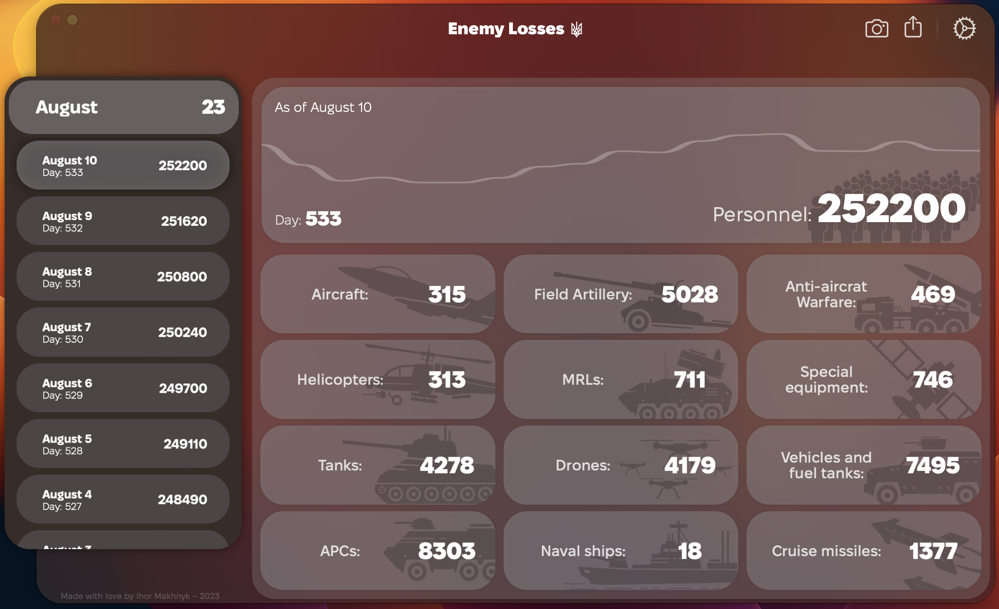
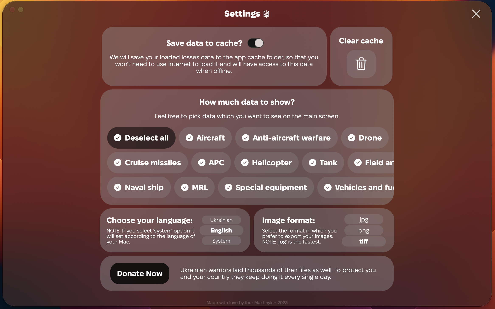
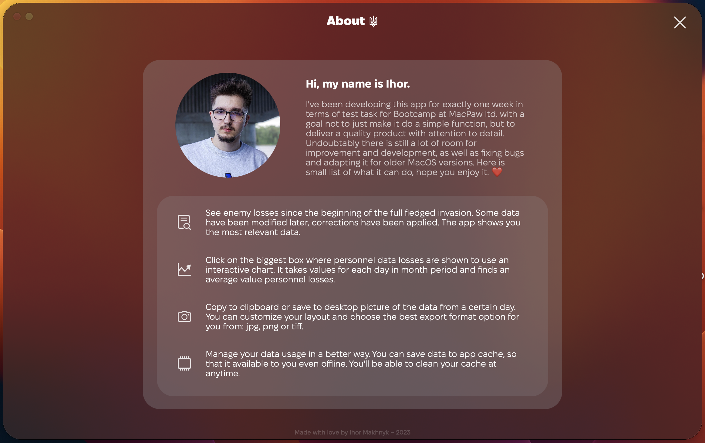
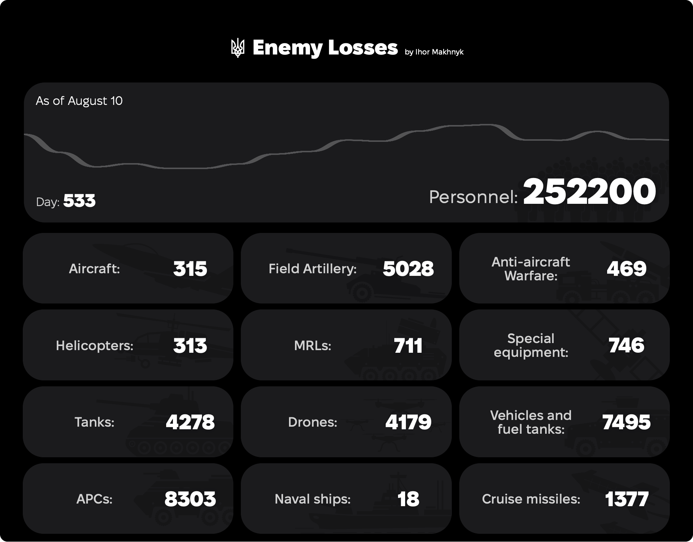
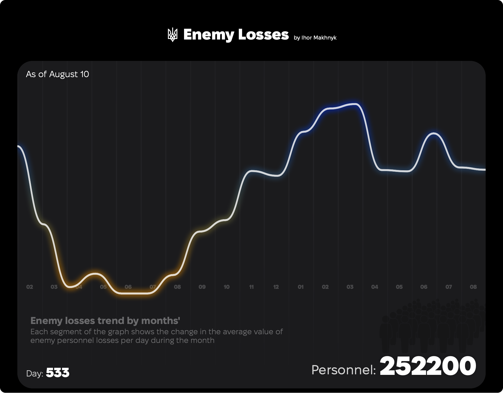
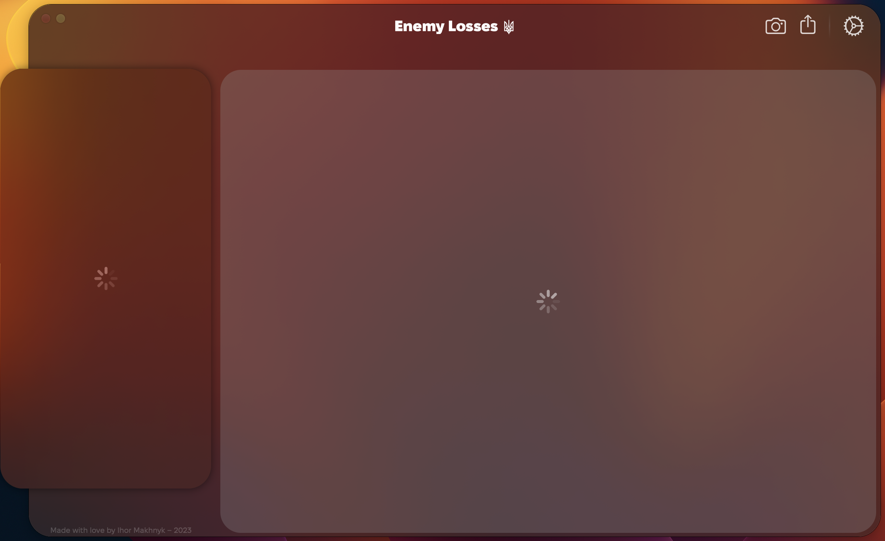
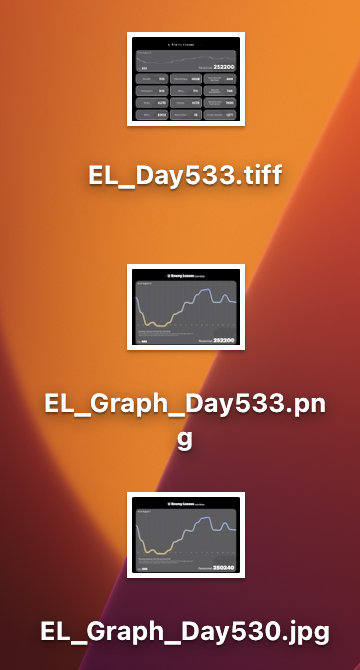

## Enemy Losses the MacOS app

Hi, this is my app which shows detailed data of enemy losses since the start of the full fledged invasion. Was in development between 21st and 28th of Augurst 2023 in terms of a test task for Bootcamp at [MacPaw](https://macpaw.com). Enemy Losses loads data about personnel and equipment losses and has has a mechanism of applying corrections for certain dates. It speaks Ukrainian and English, though uses your system language by default. Enemy Losses [features](#features) main screen layout customisation, data caching, losses progression graph and image exporting. With list of tiny user oriented details you can get familiar [here](#details).

- [Interface](#interface)
- [Features](#features)
- [Details](#details)
- [To-Do for product release](#to-do-for-product-release)
- [Suggested improvements](#suggested-improvements)

|For MacOS Ventura+ (13.0+)|
|:---|
|[Download](https://github.com/IhorMakhnyk/EnemyLossesMacOS/raw/main/Enemy%20Losses.dmg)|

## Interface
#### Main screen
This is the main screen of the app, which features pop-over interactive list of months'/days and all chosen/available data pieces about enemy losses as of selected day. Click on "camera" button to save a image or hold it to copy image to clipboard. 

By clicking on wide personnel losses panel you can open the progression graph of enemy losses personnel. It is being calculated by getting an average of losses every day of the month and presenting the dynamics of this change of averages by each month.

You can as well access two other screens apart from the main one.

#### Settings screen
Accessible through clicking a "Gear" button in the top right corner.

This is where you can adjust and customise your user experience.
-  Choose if you want to save your loaded data to **cache**.
-  **Clean** already downloaded cache.
-  Select **how much data** you want to see on the main screen, the amount of tabs will change depending on your selection.
-  Change your preferred **language** without a need to restart the app.
-  Select the **image format** in which you want to save your images to desktop.
-  **Donate** to help armed forces of Ukraine or Ukrainian people in need.

*To return click on "Cross" button on the right top corner or "Esc" button on your keyboard.*
#### About screen
Accessible by clicking on title, watermark on the bottom of the app or by pressing Shift+Command+A

This screen speaks for itself. General information about the project, app capabilities and a note from the developer.

*To return click on "Cross" button on the right top corner or "Esc" button on your keyboard.*

## Features

This is a full list of app's functionality:
- Asynchronous data fetching from three data sources.
	-  [Enemy personnel losses.](https://github.com/MacPaw/2022-Ukraine-Russia-War-Dataset/raw/main/data/russia_losses_personnel.json)
	-  [Enemy equipment losses.](https://github.com/MacPaw/2022-Ukraine-Russia-War-Dataset/raw/main/data/russia_losses_equipment.json)
	-  [Enemy equipment data correction.](https://raw.githubusercontent.com/MacPaw/2022-Ukraine-Russia-War-Dataset/main/data/russia_losses_equipment_correction.json)
- Data chuncking. The app splits data by months' to represent an array within an array of losses data.
- Graph drawing until selected period. If you select further in date history, the graph will adjust accordingly.
- Main screen layout customisation. Choose only those data items that you want to see on your main screen and save as an image.
- Data caching using CoreData the app saves all loaded personnel losses and all equipment losses which you have opened on device.
- Cache cleaning. You can clean cache by clicking the clean button or by disabling data caching in settings.
- Image saving. Copy png data to clipboard or save to desktop in:
	-  Tiff (approximate file size 21.6 MB)
	-  Jpg (approximate file size 250 KB) – _compression quality 0.75_
	-  Png (approximate file size 1.7 MB)
- Localisation. The app will dynamically change language in all or its interface, no interruption required.
- Share the app repository by clicking the share button.
- Open donation link from settings.
- As a bonus nice a dynamic smart UI adjustments.

#### App image examples

## Details

- Hints

- Indicators (not hardcoded)

- Sounds (select day,  clear cache, take picture, select what data to show)
- Animation for taking photo, with a success message

- The app cleans not only database but as well a url session cache
- On exit the app tries to clean its' url session cache
- No connection, no data state

- Loading state

- If no layout options selected the main screen shows up with expanded graph by default
- Language adaptations 

  
- Starting animation is dismissable
- Select all option

- Press Esc to return from settings or about
- Cmd+Q to quit app
- Builds appropriate names according to image content

## To-Do for product release
#### Create on server architecture
It would be great to have some sort of REST API service to fetch only the data user needs, without getting everything at once. Even though I made equipment model fetching with JSON Serialisation for exact day, but we all know that to get this part of JSON it has to load all of it.
This as well could help with app performance improvements if say we load only required parts of personnel data, maybe the first day of each month to keep disclosure groups and then it would fetch the rest when we open the month group. As right now a lot of operations with arrays are being done within the app and sometimes it noticeably slows the app down even though  these operations are being done asynchronously on the main thread. 
#### Sign the app
For publishing to the AppStore or even simple online distribution it is crucial to ensure that the application has a developer certificate. MacOS Gatekeeper will not allow to install unverified software and this could appear a big deal for most of potential users. As of right now it remains unsigned, I attached an image instruction how to allow the system to install and open the app.
#### Fix bugs
As any program Enemy Losses is not sinless, especially taking to attention that it has been created just in one week, there are some bugs that are already known to me and plenty that are yet to be unveiled. It is important to ensure that initial release is stable and consistent.
#### Apply best practices
Due to my "hackathonic" way of developing it in tight deadline with wide range of features, some of the code might be clumsy or overcomplicated. There yet remains a lot of refactoring to complete even in such simple things as sizing constants. For distribution release the code must be clean and shiny xD.
#### Adapt for wider range of  MacOS versions
Currently the app is only supported on MacOS Ventura (13.0) and higher, which covers a pretty small part of the market. I confident that before release it must be adapted at least for Monterey (12.0) as well, and preferably for Big Sur (11.0).

## Suggested improvements

#### Add interactions to equipment data
Would be nice to have more detailed information on equipment losses as well, with not only visual mathematical data, but with explanation what each item is and facts about each in context of current war. 
#### Add more interactions to the graph
Feels like it is natural for the app to have such a function to scroll through the graph itself and to select ranges on a graph to get averaged data.
#### Add push notifications for updates
As a main part of modern user experience, push notification should be sent on a daily basis a data gets updated on a server. This, of course, decreases potential churn rate and probability of a user to forget about it.
